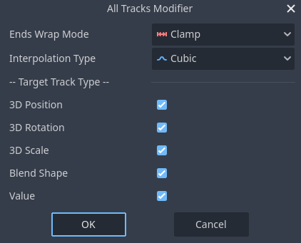

#  All Tracks Modifier

Set interpolation options for all animation tracks at the same time.

## How to Use

1. Enable AllTracksModifier plugin
2. Select one AnimationPlayer on SceneTreeDock
3. Run AllTracksModifier in `Project > Tools > All Tracks Modifier...`
4. Set options and accept dialog

### Notes

Selected animation must be editable (not imported).

Not support `Linear Angle` and `Cubic Angle` option for value tracks, since automatically detecting angle property is difficult, and there would actually be only a few angle tracks, I determined that manually setting them one by one would not be too much trouble.
